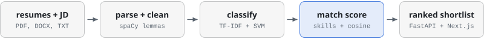
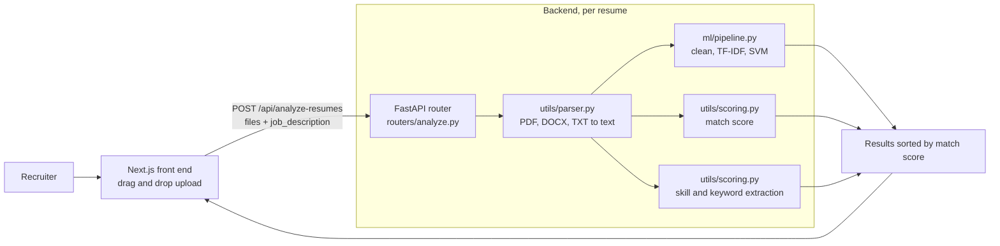

# Resume Screening Assistant

Upload a batch of resumes and a job description. Each resume is classified by job category, scored for fit against the description, and returned in ranked order with the skills that were found. FastAPI backend, Next.js front end, one command to run both.

`Python` `FastAPI` `scikit-learn` `spaCy` `TF-IDF` `SVM` `Next.js` `Docker`

<p>
<picture>
  <source media="(prefers-color-scheme: dark)" srcset="docs/pipeline-dark.svg">
  
</picture>
</p>

## Why this exists

Screening hundreds of resumes for one role by hand is slow, and two reviewers rarely rank the same pile the same way. This project applies one consistent, explainable scoring rule to every resume, so the first pass takes seconds and the ranking can be justified line by line.

## Architecture



| Component | File | Responsibility |
| --- | --- | --- |
| Parser | `backend/utils/parser.py` | Extracts text from PDF (PyPDF2), DOCX (python-docx) and TXT uploads |
| Classifier | `backend/ml/pipeline.py` | Cleans text with regex rules, vectorises with TF-IDF and predicts a job category with an SVM |
| Scorer | `backend/utils/scoring.py` | Computes the hybrid match score and extracts skills and keywords |
| Router | `backend/routers/analyze.py` | Accepts multiple files in one request, isolates per-file errors and sorts the results |
| Trainer | `backend/ml/train.py` | Fits and saves the TF-IDF vectoriser, SVM and label encoder |
| Front end | `frontend/app/page.tsx` | Upload area, job description field and ranked result cards |

## How the match score works

The score blends two signals, chosen so the ranking stays explainable to a recruiter while still catching relevance that a fixed list would miss.

```
match = 100 x (0.60 x skill_overlap + 0.40 x text_similarity)
```

**Skill overlap (60%).** Both documents are matched against a curated skill ontology covering languages, web, backend, databases, cloud, data science, data engineering, design, project management, HR, finance, marketing and security. The score is the share of the job description's skills that also appear in the resume. If the description names no known skills, the scorer falls back to overlap on nouns and proper nouns found by spaCy.

**Text similarity (40%).** Both documents are lemmatised with spaCy, stop words are removed, and they are compared with TF-IDF cosine similarity over unigrams and bigrams. Raw cosine between a relevant resume and a job description usually falls between 0.05 and 0.35, so it is scaled by 3.5 and capped at 1 before blending.

The skill term can be read back to a recruiter as a list of matched and missing skills. The similarity term rewards resumes that describe the right work in words the ontology does not contain.

## API

`POST /api/analyze-resumes` takes multipart form data: one or more `files` and an optional `job_description`.

```bash
curl -X POST http://localhost:8000/api/analyze-resumes \
  -F "files=@resume_a.pdf" \
  -F "files=@resume_b.docx" \
  -F "job_description=Backend engineer with Python, FastAPI, PostgreSQL and Docker"
```

```json
{
  "status": "success",
  "job_description_provided": true,
  "results": [
    {
      "filename": "resume_a.pdf",
      "predicted_category": "Software Engineering",
      "match_score": 71.4,
      "keywords": ["api", "docker", "fastapi", "postgresql", "python"]
    }
  ]
}
```

The values above illustrate the shape of the response. Results are sorted by `match_score`, highest first. A file that fails to parse is reported with an `error` field and does not stop the rest of the batch. Interactive docs are at `http://localhost:8000/docs`.

## Getting started

```bash
docker-compose up --build
```

| Service | URL |
| --- | --- |
| Front end | `http://localhost:3000` |
| API | `http://localhost:8000` |
| API docs | `http://localhost:8000/docs` |

To run without Docker:

```bash
# Backend
cd backend
pip install -r requirements.txt
python -m spacy download en_core_web_sm
python ml/train.py
uvicorn main:app --reload --port 8000

# Front end, in a second terminal
cd frontend
npm install
npm run dev
```

## Project structure

```
backend/
├── main.py                  FastAPI app, CORS, model bootstrap on startup
├── routers/analyze.py       /api/analyze-resumes
├── ml/
│   ├── pipeline.py          Text cleaning and category prediction
│   └── train.py             Trains and saves the models
└── utils/
    ├── parser.py            PDF, DOCX and TXT extraction
    └── scoring.py           Skill ontology, match score, keyword extraction
frontend/
└── app/page.tsx             Upload and results interface
Resume_screening_assistant (1).ipynb    Exploration notebook
docker-compose.yml
```

The notebook is where the approach was explored first: per-domain keyword scores and densities as features, and a rule-based classifier compared with logistic regression, naive Bayes and a random forest.

## Limitations and next steps

- The classifier that ships with the service is trained by `ml/train.py` on eight sample resumes, one per category, so the stack runs out of the box. Its predictions are a placeholder until it is trained on a labelled resume dataset, and no accuracy figure is claimed here.
- Matching is lexical. Replacing the TF-IDF similarity term with sentence embeddings would let the scorer match "built data pipelines" to "ETL experience".
- The skill ontology is a hand-maintained set, so new or niche skills are only caught by the similarity term.
- The front end calls `http://localhost:8000` directly. It should read the API URL from `NEXT_PUBLIC_API_URL`, which `docker-compose.yml` already sets.
- CORS is open to all origins, which is fine locally and wrong for deployment.

---

Built by [Yogdeep Benchimath](https://github.com/Yogdeep2004). More work on the [portfolio](https://deepwork-systems.vercel.app/).
